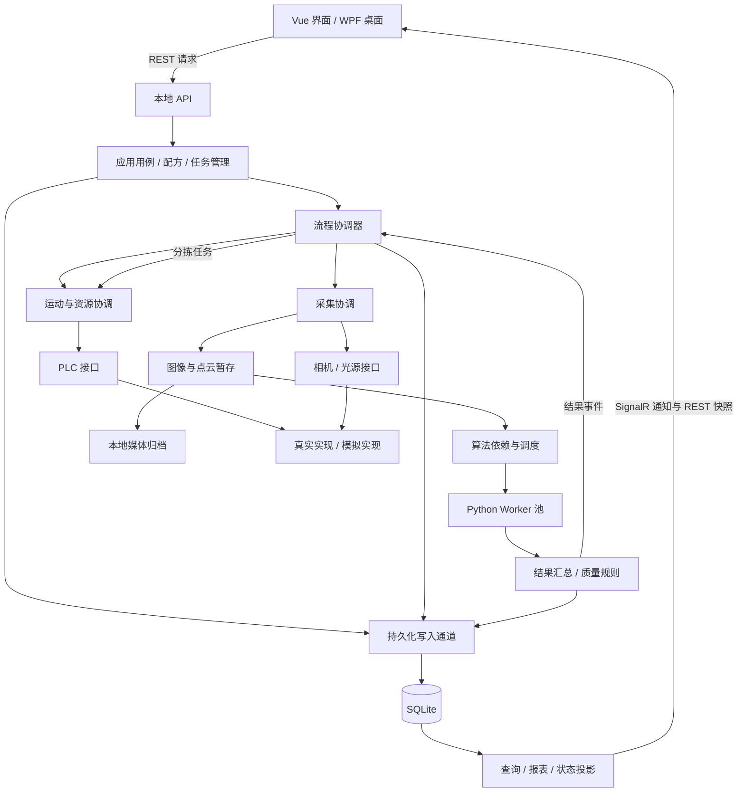

# 制冷机零件缺陷智能检测设备：总体软件架构设计

> 版本：V1.3 架构评审稿｜更新日期：2026-09-14｜初版日期：2026-09-13｜对象：上位机、算法、PLC、测试与交付团队。
>
> 本文定义模块边界、并发模型、数据流、接口原则和实施顺序，不是详细代码设计、最终 PLC 点表或已经完成的性能验收报告。工艺以用户本轮确认及最新对接图为准。MES、训练范围、硬件与算法性能仍待补充，不阻碍先开发本地检测骨架。

V1.1 补充后续架构问答：第 3.4 节明确层级与模块数量，第 4.1～4.4 节说明相机/光源启动和常驻方式，第 7.3～7.5 节明确上位机承接的 PLC 职责及模块封装。所有内容仍为设计，不代表硬件功能已经实现；光源具体模式等未确认项继续保留。

V1.2 更新异常流转要求：可隔离且不影响后续动作安全、身份关联和必要保存的异常，随工件标记后继续；算法/采集失败形成明确终态，不因单件失败阻塞整盘。第 5、8～10、12、14、18 节同步定义汇合期限、处置策略、Pending 分流与验证要求。未知运动状态、可靠坐标缺失、严重数据/资源故障仍保留停止边界。

V1.3 补充数据库一键部署与迁移：第 12.5～12.8 节定义初始化、结构升级、数据搬迁和恢复；第 17.1 节定义独立部署工具与界面入口，第 18 节补充对应验收。只增加部署维护能力，不改变 5 层/15 个责任模块，也不表示本轮已执行数据库操作。

## 1. 一页式架构结论

采用 **本地模块化单体后端 + Vue 桌面界面 + 独立 Python 算法进程 + 可插拔设备适配 + 有界流水线**。

核心设计不是“让所有动作同时做”，而是 **机械动作只占用必要的物理资源，图像一旦安全采得，计算、存储和显示独立推进**。一个料盘内不同零件、不同图像的算法可以重叠运行；同一 XY 平台和共用夹爪不能同时执行互相冲突的动作。

| 决策 | 本项目采用的方式 |
| --- | --- |
| 前端 | Vue 3、TypeScript、Pinia；REST 命令/查询，SignalR 状态通知 |
| 桌面 | WPF + WebView2；只负责窗口、本地页面和少量系统操作 |
| 后端 | C#/.NET 10 架构方向，ASP.NET Core Host；一个正式业务入口 |
| 工艺组织 | 配方生成检测计划；短处理的事件驱动状态机推进，不把整个检测循环放进一个长阻塞函数 |
| 机械执行 | 一条设备运动任务通道；XY、共用 Z、夹爪/旋转/翻面/分拣空间按实际资源互斥 |
| 算法 | 常驻 Python Worker；CPU/GPU 分池、有界调度、按依赖触发；不每张图重启 Python |
| 大数据 | 图像/点云引用传递；一期用本地 SSD 暂存文件，内存管理留扩展口，不用 JSON/Base64 搬运全图 |
| 持久化 | SQLite + EF Core；短事务、单写入通道、独立查询；媒体与日志放文件 |
| 数据库部署 | 独立离线工具支持一键初始化、升级、搬迁与恢复；自动备份、维护互斥、版本识别、失败可追溯，不在生产运行中自动改表 |
| 模拟 | 全模拟、图像回放、真实设备混合、人工交接；同一业务代码、同一接口 |
| 校验 | 边界一次校验 + 必要工艺互锁；不做逐帧重复哈希、层层重复检查 |
| 异常 | 可隔离异常随工件标记继续，判定不确定进入 Pending；中文报警 + 结构化日志，不因单件算法失败全机停机；安全/身份/必要保存失效仍停止受影响流程 |
| 不引入 | 微服务集群、外部消息中间件、Redis、网络对象存储、全量事件溯源、自动生产训练、运行中任意热插拔 |

成功标准：能在虚拟设备上走通全部业务；替换适配器后能接真实设备；机械不冲突、图像不串件、任务不失控积压、界面不被检测阻塞、异常可定位且可恢复。真实检出率与 ≤10 秒/面的指标必须用实际样件和完整流程验证。

## 2. 资料依据、已确认边界与未决项

### 2.1 资料与使用顺序

1. 用户本轮明确确认的设备关系和工艺规则，优先级最高。
2. [架构设计.zip](架构设计.zip) 中“上下位机对接.zip”的 11 组流程/时序图：作为最新工艺基准。
3. 《制冷机零件缺陷智能检测设备_软件需求规格说明书_V1.2》：功能范围补充。
4. 《制冷机零件缺陷检测 SRS_PLC 接口设计规范报告》：通信与握手参考，不直接视为已冻结点表。
5. 《X零件缺陷智能检测设备 软件算法系统技术规格书及验收标准 V1.0》：质量、追溯与验收要求参考。
6. 《检测场景及零件整理(20260313).xlsx》：型号/场景/物料/检测面的矩阵依据。
7. 《技术文件（带目录）0626.pdf》及独立时序截图：历史选型、工艺和功能补充，不覆盖新确认。
8. [工业视觉流水线线程架构文章](90%25%20的视觉设备卡顿漏检，根本不是算法问题！工业视觉流水线线程架构深度拆解.md)：借鉴职责拆分和队列解耦，不照搬线程数量与性能结论。
9. [137 项目总结](137-housing-inspection/PROJECT_SUMMARY.md)及对应源码：框架和工程经验参考，不搬入其业务工位及历史包袱。

阅读范围：已提取并核对三份 Word 正文/表格、Excel 两张工作表、11 组 SVG 图中的流程说明，查看独立时序图，阅读 PDF 的设备、软件、机械、流程及节拍相关章节；PDF 后部通用算法综述、商业/标准条目仅作为背景，不作已验证的算法或合规结论。Excel 内嵌零件图和 PDF 全部机械图片不视为已完成尺寸审图。本文不宣称已校核真实光学效果、机械干涉或电气安全设计。

### 2.2 用户已确认

| 编号 | 约束 | 架构影响 |
| --- | --- | --- |
| C01 | 只有一套 XY 平台，同一时间一盘、一个运动任务 | 不设计多盘并行或多个运动模块竞争写 XY |
| C02 | A/B/C/D 位于不同位置，必须移动后分别拍摄 | 相机采集串行不等于算法必须串行 |
| C03 | 旋转、翻面、分拣共用夹爪及空间 | 统一机械资源管理，不各建一个自主运动线程 |
| C04 | 普通件按整盘批采、整盘翻面组织 | 按面、相机遍历槽位；不能按单件完成所有面后再检下一件 |
| C05 | 每轮翻面后重扫整盘 3D 并重算坐标 | 新建坐标批次，旧坐标失效；工件身份不变 |
| C06 | PC 计算绝对坐标，PLC 实现动作内部闭环与互锁 | PC 不接管伺服实时控制和夹爪内部动作细节 |
| C07 | 相机人工固定调焦 | Z 轴到配方/3D 推导的成像高度，不实现搜索式自动对焦 |
| C08 | 算法从头开发，预计 Python；硬件暂定，无实测耗时与拍照次数 | 先冻结调用契约，进程数、缓存和超时可配置 |
| C09 | 缺失运动硬件时允许人工交接后继续联调 | 模拟动作与人工真实移料分开记录，不能把虚拟到位当真实到位 |
| C10 | 最新对接图优先 | 相机角色按 A/B/C/D、E、F、3D 建模，旧 Qt/自动对焦等不继承 |

A/B/C/D 共用成像 Z 轴，E 使用独立 Z 轴，按最新图作为当前设计输入；具体运动包络和到位判据由 PLC/机械团队在接口联调前给定。“整盘翻面”表示整盘零件完成一轮翻面，不擅自推断为物理上将整个托盘一次倒转；机构内部实现由 PLC 封装。

### 2.3 本轮暂不冻结

- MES 本期范围及是否接工厂内网：当前实现不依赖 MES；预留独立适配边界，不默认为合同删除项。
- 样本标注、训练、评估的交付范围和运行位置：定义接口与版本边界，本期不强制运行训练服务。
- CPU/GPU/内存/磁盘、厂商 SDK、Python 版本、模型格式：先验证后锁定。
- 每面拍照次数、灯光方案、多图融合方式、特殊类型4步骤、量程公差与判定规则：由配方表达，未提供时不得生成真实生产的“合格配方”。
- Windows 具体版本、备份保留期、图像保留期、复核权限、成组物料联动分拣规则：列入第 20 节待办。

## 3. 分层结构与依赖规则

### 3.1 逻辑架构



图表示职责与数据方向，不表示所有箭头同步等待，也不表示每个框部署成一个服务。

### 3.2 模块责任表

| 层 / 模块 | 负责 | 明确不负责 |
| --- | --- | --- |
| Desktop / Presentation | 窗口、登录、看板、配方编辑、追溯、工程联调 | 直接读写 PLC、调用 Python、操作数据库 |
| Api | DTO、入口基本校验、权限、命令受理、查询 | 工艺状态机、长时间等待硬件完成 |
| Application / Jobs | 工单、批次、盘任务、暂停/恢复、单步、复核用例 | 厂商 SDK 和寄存器细节 |
| Recipes | 型号/场景匹配、采集步骤、算法和阈值版本、点位引用 | 运行中悄悄修改已开始任务的配方 |
| Workflow | 将检测计划推进到下一步，协调采集、判定和分拣 | 图像计算、直接磁盘 I/O、循环等 PLC 位 |
| Motion | 整体动作编排、资源预约、命令生命周期 | 直接输出质量结论、绕过 PLC 互锁 |
| Acquisition | 曝光/光源设置、到位后触发、帧绑定、缓存归属 | 缺陷推理、报告生成 |
| AlgorithmRuntime | 依赖检查、CPU/GPU 调度、Worker 生命周期、任务期限 | PLC 控制、最终分拣目标选择 |
| Quality | 相机组/检测面/单件融合，OK/NG/Pending，复核修订 | 猜测缺失结果为 OK、以程序成功代替合格 |
| Traceability | 保存任务、结果、动作、媒体索引与版本；历史查询 | 保存全部高频轮询值，跨线程共享 DbContext |
| Media | 暂存、原图/点云归档、缩略图、空间配额 | 把大图塞进数据库或 SignalR |
| DeviceAdapters | PLC、相机、扫码、光源的真实/虚拟适配 | 独立维护第二套工艺和配方逻辑 |
| Diagnostics | 报警状态、运行指标、结构化日志、诊断包 | 在错误时自动变更业务规则或静默放行 |
| ModelManagement | 模型版本导入、发布、回退接口；训练范围后续补充 | 自动替换生产模型或作为未配置时的强制运行服务 |
| MES | 预留上传与回执适配，范围后续补充 | 作为当前本地检测链路的强制前置服务 |

### 3.3 依赖约束

- Domain 存放工件、配方、质量及工艺规则，不引用 EF、HTTP、SDK 或 Python。
- Application 定义用例和所需接口，依赖 Domain；基础设施实现接口，Host 在唯一组合根装配。
- 横向共享只保留身份、状态、错误和设备/算法契约，不创建包罗万象的 Common/Utils。
- 流程实例由一个明确所有者更新；其他模块返回事件或结果，不直接修改“当前工件”等全局对象。
- 模块内部普通函数调用优先。跨耗时/资源边界才使用队列；不用全局事件总线隐藏所有调用关系。
- 自动流程与工程单步共用动作/采集/算法用例，不复制两套执行器。工程操作同样经过机械资源协调。

### 3.4 层级与模块数量的统一口径

本文按 **5 个逻辑层 + 横向支撑能力、15 个责任模块** 组织。V1.0 的责任表为 14 组，其中模型管理与 MES 合写一行；V1.1 将二者分开，统一为 15 个模块。Desktop/Presentation 仍计为一个界面责任模块，模块内部可以有 WPF 与 Vue 两个工程。

| 逻辑层 / 横向能力 | 对应责任模块 | 数量 |
| --- | --- | --- |
| L1 表示层 | Desktop / Presentation | 1 |
| L2 接口层 | Api | 1 |
| L3 应用编排层 | Application / Jobs、Recipes、Workflow、Motion、Acquisition | 5 |
| L4 领域与算法层 | Quality、AlgorithmRuntime | 2 |
| L5 基础设施层 | Traceability、Media、DeviceAdapters | 3 |
| 横向支撑与扩展 | Diagnostics、ModelManagement、MES | 3 |
| 合计 | 12 个主链路模块 + 3 个支撑/扩展模块 | 15 |

这是职责归类，不是强制逐层调用的瀑布，也不是依赖方向图。Domain 的纯规则与接口保持独立；AlgorithmRuntime 的调度和 Python 进程适配分别落在应用/基础设施实现中，不能因归在“领域与算法层”就让 Domain 引用 Python 或 SDK。横向能力不是所有请求都必须经过的第六层。

15 个模块不等于 15 个进程、15 个专用线程或 15 个项目。流程、运动协调和采集协调默认同在 Host 进程，通过独立执行通道协作；物理资源互斥和进程隔离按第 4、6、7 节实施。MES 和训练相关扩展的范围仍待确认，列入模块不表示本期全部实现。

## 4. 运行进程与部署关系

| 运行单元 | 数量与职责 | 生命周期 |
| --- | --- | --- |
| Desktop | 1 个 WPF 壳，WebView2 内显示 Vue | UI 可重启，不直接重启检测任务 |
| Inspection.Host | 1 个正式后端进程；业务、API、调度、数据库 | 唯一生产任务所有者；重复启动应清楚提示 |
| DeviceHost | 按需隔离不稳定/有位数限制的原生相机 SDK | 初期可同厂商一组；有故障隔离需求再拆分，不为每个小接口增加进程 |
| Python Worker | 按 CPU/GPU 池配置的常驻进程 | 启动时载入模型；任务失败受控回收，不每次采集启动 |
| VirtualDeviceHost | 可选独立进程，提供虚拟 PLC、场景与故障注入 | 本机或联调电脑运行；正式生产无需安装/启动 |
| Training Worker | 预留，不默认部署 | 后续明确资源与范围后启用；不能挤占生产推理 |
| Database.Deployment.Tool | 按需启动的独立本地部署工具；初始化、升级、搬迁、恢复 | 非常驻业务进程；与 Host 共用数据库访问/维护互斥协议 |

设备 Host 只封装 SDK 和采集，不放入工艺。PLC Modbus 客户端可在主 Host 内异步运行；原生 SDK 是否隔离根据稳定性、位数与接口阻塞特性选择。独立进程是故障隔离边界，不是越多越快。

默认前后端仅回环地址通信，静态资源全部本地打包；设备局域网仅用于 PLC/相机等设备通信。开发时可打开浏览器，正式运行用桌面壳，业务逻辑相同。

### 4.1 相机和光源是否常驻

原则：**管理服务常驻、设备连接复用、采集按任务触发**。常驻的是管理硬件的软件，不表示相机一直拍摄或光源一直点亮，也不表示上位机能够直接给所有硬件通断电。硬件供电由电气方案决定；此处“启动”指 SDK 初始化、建立连接和进入可用状态。

| 对象 | 常驻与连接方式 | 是否独立进程 |
| --- | --- | --- |
| 设备管理能力 | 在 Host 中负责适配器创建、连接状态和生命周期；属于 DeviceAdapters 内部能力，不新增第 16 个模块 | 默认否 |
| Acquisition 采集协调 | 常驻 Host，接收采集任务，组织到位、光源和相机时序 | 默认否 |
| 相机 SDK / 连接 | 初始化后保持连接，复用接收回调和有界缓冲，检测间隙待触发 | 按需放常驻 DeviceHost；不强制一相机一进程 |
| 光源控制 / 连接 | 复用串口或网络连接，根据采集策略设置亮度及开关 | 通常不单独开进程；特殊 SDK 需求另行隔离 |
| Python 算法 | Worker 常驻、按当前计划预热模型，与相机采集服务分开 | 是，按配置建立工作进程池 |

每台相机有受控的 SDK 访问通道，但不必占用一个专用 OS 线程。SDK 要求线程亲和性或存在阻塞调用时，才配置专用线程/隔离进程。不能每拍一张图就重新创建连接、初始化 SDK、启动 Python 再退出。

### 4.2 上位机启动时的设备初始化

1. Host 读取设备绑定，创建真实或模拟适配器；先完成基础配置检查。
2. 初始化相机 SDK、打开指定设备，建立光源串口/网络连接。互不依赖的设备可有界并发连接；同一 SDK 不支持并发初始化时内部串行。
3. 注册图像/断线回调，准备有界接收缓冲，设置基础触发模式和安全的光源初态。
4. 读取设备状态并加载必要基础参数；具体配方尚未确定时，不提前套用上一盘配方。
5. 设备进入 Ready；首次采集前应用当前任务冻结的相机和光源参数。

初始化状态建议统一为 Disconnected → Connecting → Initializing → Ready，故障进入 Faulted/Reconnecting。某台设备不可用时 UI 仍应打开并显示原因；只阻止依赖该设备的任务，不把无关、未配置的扩展服务当作全机启动故障。

### 4.3 单次采集与光源时序

采集协调器执行：预留缓存/下游容量 → 申请必要机械与采集资源 → 确认本次动作到位 → 应用有变化的曝光、增益、亮度等参数 → 点亮光源并等待配置的稳定时间 → 触发相机 → 收到完整帧并安全接管 → 按光源策略关灯或保持 → 释放可释放的资源。

到位、曝光/帧接收、缓存归属的边界遵循第 7、8 节。采集完成后，普通缺陷算法和媒体存储继续后台执行，机械无需等待普通算法；必要的快速图像有效性检查仍按第 5.3 节执行。

参数未变化且连接仍有效时不重复下发，缓存“已成功应用的参数版本”。重新连接、设备复位、工程调试修改参数后，该缓存失效并重新加载，不能把旧缓存当作新设备状态。

| 光源方式 | 设计策略 | 当前确认程度 |
| --- | --- | --- |
| 软件按次点亮 | 默认建议：拍前开启、稳定后触发，采集后关闭 | 具体稳定时间、接口能力待实机确定 |
| 连续批采保持点亮 | 在亮度不变、热稳定及使用条件允许时，可跨相邻采集保持开启，减少重复稳定等待 | 按灯具能力和配方验证后启用，不默认永久常亮 |
| 曝光同步频闪 | 上位机配置采集任务；相机/光源硬件信号负责曝光期间精确同步 | 需相机、控制器和接线支持，目前未冻结 |

停止、取消、异常和正常退出时执行光源关闭/安全状态策略。PC 崩溃或通信中断后不能保证软件还能关灯；如灯具存在温升或其他限制，应使用控制器超时保护或电气侧方案，不能只依赖退出回调。

### 4.4 设备断线、重连与退出

- 由所属适配器统一处理有界重连，避免流程、UI、采集服务同时重连同一设备。
- 断线时停止该设备的新采集；当前帧/任务失败或未知，不能将“重新连上”当成原拍照任务成功。
- 重连后重新注册必要回调、确认触发模式、加载参数、重建有效缓冲并核对状态；旧连接迟到的回调不得绑定到新任务。
- 若工件位置或运动状态可能已变化，先由 Workflow/Motion 重新确认，再决定重拍或人工恢复；不能自动补发一次危险动作。
- 退出时先停止新触发，收敛在途回调与引用，再注销回调、关闭设备/连接并释放 SDK，防止回调访问已释放缓冲。

这部分补齐了初版分散在进程、资源和启动章节的内容；光源开关/频闪细节仍是待实机验证的策略，不是已实现的硬件行为。

## 5. 核心工艺与数据生命周期

### 5.1 身份先固定，坐标和采集尝试可更新

身份层级：Batch → TrayRun → Part → Face → CaptureSet → Frame / AlgorithmJob。

- TrayRunId 表示一次装盘检测，不以可重复使用的物理托盘码作为唯一任务 ID。
- PartId 在识别有效槽位后生成；SlotId 是初始/当前空间位置，不等于永不变化的工件身份。
- 来料检没有单件码也可追溯；后续 E 相机读出的码绑定到已有 PartId，不另建一件。
- 成组场景增加 GroupId，关联多个物料与被扫码的主体件；不假设一个二维码代表所有零件各自独立编码。
- 翻面新建 CoordinateEpoch，保留 PartId 和历史检测结果。禁止因“全新一盘重定位”而丢掉前几面结果。
- 重拍增加 Attempt；旧帧/旧算法结果保留但不覆盖新的有效尝试。

CoordinateEpoch 限制的是新的定位/运动请求。翻面前已经合法采得的图像，其后台算法仍可完成并归入原 Face/CaptureSet，不能因当前坐标批次更新就误删上一面的有效结果。重启会话和重拍 Attempt 则用于区分应拒收的陈旧动作反馈/算法结果。

### 5.2 启动与整盘识别

1. 工单/批次与场景建立，UI 提交“准备检测”请求。
2. PLC 负责实体启动按钮、安全互锁与夹紧；收到新鲜的夹紧/就绪状态后才推进。
3. 移至 3D 位，采集点云，识别有无、姿态、位置；移至 F 位识别料盘码。
4. 按料盘码与场景匹配唯一配方，生成整盘计划、PartId、面列表、相机组和算法依赖。
5. 冻结本次任务的配方、标定和模型版本；识别冲突或配方缺失时停在明确的准备失败状态。

初次扫描/料盘识别需使用已示教的公共准备流程，不得依赖“扫码后才知道的配方”才能完成第一次扫码，避免循环依赖。

### 5.3 普通件：整盘按面批采

1. 使用当前 CoordinateEpoch 计算该面的 A 位目标与成像 Z 高度。
2. 逐有效槽位移动、确认到位、触发光源和 A 相机、接收完整帧、完成快速采集有效性检查。
3. 完成 A 当前面整盘批采后，再对 B 重复整盘批采。使用 C/D 的面按相同规则执行。
4. 每张可用图到达后立即开始不依赖另一张图的预处理/单图分析；同件同面所需 A/B 或 C/D 输入齐备后触发融合。
5. 当前面所有计划采集已结束（成功或明确失败），且机械状态满足继续条件后，允许进入翻面；单帧无效不默认要求现场反复重采。普通缺陷计算继续后台执行，不要求全盘算法先算完。
6. 整盘完成一轮翻面后，旧坐标失效，必须重新扫描 3D、重新对应工件和槽位并生成新坐标，才能开始下一面。
7. 按配方进入 E 零件扫码动作；扫码结果绑定已有身份，不阻塞与其无关的后台算法。
8. 全部必检面任务达到明确终态，或达到工件判定截止点后收敛未完成项，再逐件判定；整盘检测阶段结束后执行普通件 NG/Pending 分拣，OK 默认原位。已知失败不占住汇合等待。

第 5 步区分“图像不能用于质量判断”和“设备/工件状态不允许移动”：前者记录当前项无效并继续其他可执行检测，最终按规则进入 Pending；后者才阻止相应动作。若快速图像检查承担定位或安全相关的必要前置条件，其失败仍须停止依赖该结果的动作。后到的无效结果不擅自驱动已改变位置的工件回退；重采仅在安全条件仍满足且不突破流转预算时有界执行，默认不为普通缺陷算法失败同步等待修复。

以下展示允许的重叠关系，不表示固定耗时或机械并行：

| 当前机械阶段 | 同时可运行的算法 | 同时可运行的存储/显示 |
| --- | --- | --- |
| A 相机采第 i 件 | 已采 A 图的单图处理 | 前面帧暂存/归档、缩略图刷新 |
| A 整盘结束，B 相机采第 j 件 | 前面 A 图处理，以及输入已齐的 A/B 融合 | 前面结果保存，当前进度展示 |
| 整盘零件逐个翻面 | 本面剩余普通缺陷/融合任务 | 当前面媒体归档、结果保存 |
| 翻面后整盘 3D 扫描/定位 | 3D 优先处理；预算允许时继续旧面算法 | 旧面归档与状态查询 |
| 最终分拣 | 无关的后台报告任务 | 匹配反馈后保存分拣完成；不可提前记完成 |

### 5.4 特殊件：独立工艺模板，共用执行模块

| 类型 | 由用户确认的特征 | 流程模板 |
| --- | --- | --- |
| 类型1 | 需旋转到指定角度 | 从原位取出 → 放入旋转工位 → 旋转到位 → 按配方采集 → 判定 → 原位/NG/Pending |
| 类型2 | 需 A/B 相机组 | A 采集 → B 采集 → 融合；取放/旋转是否需要由该配方步骤声明 |
| 类型3 | 需 C/D 相机组 | C 采集 → D 采集 → 融合；不隐含额外旋转 |
| 类型4 | 特殊角度或组合 | 使用已有动作/采集/算法步骤组成专用模板；新动作语义需开发接口，不执行任意脚本 |

类型不是四套互相复制的软件，也不是完全互斥的物理能力。类型1也可能使用 A/B；配方用“搬运方式 + 旋转角度 + 相机组 + 检测面 + 判定依赖”表达实际组合。

特殊件在旋转位判定期间，该件仍占据夹具。算法运行不持有编程锁，但物理占用不能释放；如果下一件需要同一夹具，就必须等当前件判定并取走。这是机械约束，不应伪装成能够无限并发的流水线。

等待有明确截止点：算法失败立即形成异常结果，未结束任务到期标记超时；判定不确定则进入 Pending。在取放坐标可靠、夹爪状态明确且 Pending 目标有容量时，将该件安全移出后继续下一件，不为等待 Worker 修复一直占住旋转工位。没有可靠移出路径时暂停，不能把“标记后继续”解释为忽略真实占用。

### 5.5 最终判定与分拣

1. 以任务冻结的必检输入/算法清单检查完整性，技术状态与质量结果分别保存。
2. 默认执行所有仍可执行的必检项，不因某面已 NG 或另一算法失败就擅自跳过独立检测项。因失败输入确实无法执行的依赖项标记 DependencyFailed；到判定截止点仍未完成的项标记 TimedOut。这里的“流程完成”是任务已收敛，不要求检测全部成功。
3. Quality 输出 OK/NG/Pending：全体必检项有效且符合规则才可 OK；可靠证据已确定 NG 时可保留 NG，同时记录检测不完整及异常；无确定 NG 且存在影响判定的失败/缺失时为 Pending。NG 证据必须属于正确工件和有效尝试，身份不明不能靠 NG 标签继续自动分拣。普通单件异常不默认暂停整盘，不用零值参与测量或伪造成功。
4. 保存最终结果与分拣计划，预约目标空槽；同时只允许一个共享夹爪动作执行。
5. 下发本件取料/放料坐标和命令序号；收到匹配的完成反馈后保存分拣事实并更新槽位占用。
6. 分拣完成、必要数据保存确认、工件状态闭合后才允许料盘解锁取走。报表排版可后台完成，不能用“正在生成报表”冒充“没有保存检测结果”。

最终判定与分拣计划在提交执行前冻结 DecisionRevision。普通算法后台重试/迟到输出不自动改写已冻结的去向；可保存为补充结果或复核修订。未冻结前只有仍属有效尝试且在期限内的结果可参与判定。Pending 区满或抓取状态未知时暂停受影响分拣，不能将 Pending 混入 OK 区。

## 6. 线程、异步任务和进程分工

**模块不等于线程，async 不等于并行，排队不等于持久化。** 下面的“执行通道”是明确的消费者/所有者；除 UI、SDK 特定要求和独立工作进程外，不绑定某个固定 OS 线程。

| 执行单元 | 建议方式 | 能做什么 | 禁止做什么 |
| --- | --- | --- | --- |
| UI | WPF Dispatcher / 浏览器 UI 线程 | 展示、输入、小量状态合并 | 同步等硬件、计算全图、长列表无分页 |
| API | ASP.NET 异步请求 | 受理命令、返回命令 ID、查询快照 | 把 10 秒检测放在 HTTP 请求内等完成 |
| 流程事件通道 | 1 个逻辑消费者，短事件处理 | 变更流程状态、发下一步请求 | 在事件处理器内等完整算法或机械动作结束 |
| 运动任务通道 | 1 个设备级执行所有者 | 资源预约、整体动作投递、匹配完成事件 | 持锁等待、多个模块写相同运动命令 |
| PLC 通信泵 | 独立异步读写调度 | 状态轮询、命令写入、心跳、超时 | 执行算法/报表；被长动作等待占住轮询 |
| 设备采集通道 | 每台设备串行访问 SDK；必要时专用线程/DeviceHost | 触发、帧接收、元信息绑定 | 在 SDK 回调里压缩存图、推理、等队列空位 |
| 图像暂存通道 | 有界 I/O 作业并发 | 归属接管、写入暂存、分发引用 | 无界复制图像、阻塞采集回调 |
| 算法调度通道 | 1 个逻辑调度器 + CPU/GPU Worker 池 | 输入齐备判断、派发、超时与回收 | 调度器亲自运行 Python 运算 |
| 结果汇总通道 | 1 个逻辑消费者，按 Part/Face 分组 | 接收乱序结果、形成质量状态 | 以消息到达顺序猜工件 |
| 数据库写入通道 | 1 个写入所有者 | 小批量短事务、关键保存确认 | 图像压缩、调用 PLC、持事务等 Worker |
| 查询/报表通道 | 独立短读连接 + 受限后台报表任务 | 查询、导出、历史统计 | 长事务扫描拖住生产、复用写入上下文 |
| 日志/归档/备份 | 独立有界后台作业，低于生产优先级 | 日志落盘、媒体转存、备份 | 消耗全部 I/O 带宽或无限增长 |

流程事件处理方式：收到请求后记录“等待动作完成”，投递动作请求即返回；完成事件到达后再推进。不是把整段动作 await 在唯一事件消费者里。心跳、停止请求、告警处理因此仍可继续。

控制消息与大图任务使用不同通道，停止/故障事件有独立保留容量及优先处理路径。事件消费者不能持有自身执行权等待一个必须由它处理的完成消息；数据库保存确认也通过回执续推，不在全局流程锁内等待。UI 读取不可变快照，结果汇总只更新自己拥有的状态，再向 Workflow 发送事件，避免多个模块同时写同一个对象。

阻塞式 SDK 调用无法仅靠增加 async 关键字变成非阻塞。不能取消的厂商调用在可隔离进程运行，超时后停止使用该设备并受控重启；真正硬件状态仍须重新确认。

## 7. 机械资源同步与动作边界

### 7.1 资源模型

| 资源 | 所有者与规则 |
| --- | --- |
| XYPlatform | 同时一个运动任务；所有定位、扫描位移动、扫码位移动都经过 Motion |
| ImagingZ | A/B/C/D 共用；设高度至曝光完成期间不能被其他采集改动 |
| CodeZ | E 独立 Z；不据此假定可以与 XY/夹爪同时运动，仍看干涉关系 |
| HandlingCell | 共用夹爪、旋转、翻面、分拣空间；整体动作独占 |
| Camera / LightChannel | 采集期间参数与光源配方独占，防止另一任务改曝光/亮度 |
| SlotReservation | 分拣目标槽预约；成功放料后变为占用，失败/未知不能直接释放 |

初版按用户确认，同一设备只派发一个整体运动任务。XY/Z 如需协同，作为一个 PLC 已定义的整体动作执行，不由两个独立 PC 线程各发各的轴命令。将来机械方确认可并行的独立轴组后，仅扩展资源兼容表，不重写算法/质量层。

### 7.2 同步规则

- Motion 一次性预约动作需要的全部资源；不先占 XY 再等夹爪、另一动作占夹爪再等 XY。
- 资源预约是业务状态，不是把线程锁从下发一直持有到反馈。普通内存锁只包住很短的状态更新。
- 曝光和采集结束条件由设备契约明确；不能只凭“触发命令发送成功”就移动料盘。
- 帧已由软件安全接管、允许运动条件满足后释放采集相关运动资源；普通缺陷计算不占 XY。
- 超时、取消或进程退出不等于硬件已停止。资源标为 Unknown/Held，等待 PLC 停止/位置确认及必要人工复位。
- 停止请求关闭新动作准入；正在运行的动作按 PLC 支持的受控停止执行。硬件急停由电气安全回路负责。
- 自动、示教、工程单步三者只能有一个运动控制权；调试不能通过直接写寄存器旁路仲裁。

“PLC 无状态”应理解为不保存配方及整盘业务进度，而不是没有当前动作状态。PLC 必须保留运行期间的命令序号、忙/完成/失败、互锁和心跳状态；否则无法防止重复执行和陈旧完成信号。

### 7.3 哪些下位机职责由上位机承担

原始 SRS 与 PLC 报告明确采用“上位机全流程编排”的方向；用户已确认 PC 管理配方/坐标、PLC 执行动作内部闭环。因此本架构确实将部分原本也可放在 PLC 内的工艺逻辑放到 PC，但不替代 PLC/驱动的实时运动与硬件保护。

| 功能 | 上位机 | PLC / 驱动 / 电气安全侧 |
| --- | --- | --- |
| 整盘与多面流程 | 选择零件、面、相机组、下一步，保存业务进度 | 执行收到的整体动作并反馈 |
| 配方与坐标 | 配方匹配、示教点保存、3D 定位、坐标转换、取放目标计算 | 接收并锁存动作参数，完成轴运动 |
| 翻面与旋转 | 决定时机、目标面/角度、资源预约 | 执行机构内部时序、互锁及到位反馈 |
| 分拣 | 质量判定、目标槽位选择、取放位置与任务关联 | 实际夹取、搬运、放料及失败反馈 |
| 相机/光源/扫码 | 直接连接、配置、触发和接收数据 | 提供所需运动许可/到位状态；不承担视觉运算 |
| 故障恢复 | 未完成任务对账、告警展示、人工确认组织 | 反馈真实位置、当前动作和硬件故障 |
| 实时控制与保护 | 请求受控停止、显示状态，不接管底层保护 | 轴/驱动闭环、安全互锁、实体按钮、失联保护 |

旧 PLC 报告仍有“PLC 更新内部坐标表并查表分拣”的描述，与新要求有冲突。本文采用用户确认的“PC 下发取放坐标、PLC 执行”边界；具体寄存器和协议按第 11 节重新对齐，不直接照搬旧表。

### 7.4 封装方式：三个独立模块，而非新增一个 PLC 功能层

| 模块 | 封装的责任 | 对外接口与隔离边界 |
| --- | --- | --- |
| Workflow（应用编排层） | “下一步做什么”：检哪个件/面，何时翻面、重扫、分拣，暂停后怎样继续 | 发业务请求、收完成事件；不认识 PLC 寄存器、不直接访问 SDK |
| Motion（应用编排层） | “这次动作如何有序执行”：整理参数、预约资源、命令排队/跟踪、停止与超时处理 | IMotionService；是运动任务协调器，不是伺服控制器 |
| DeviceAdapters 中的 PLC 适配（基础设施层） | “如何与 PLC 通信”：动作编码、连接、轮询、心跳、反馈解析 | 设备动作映射内部封装；IPlcTransport 负责底层读写和状态观察 |

Motion 依赖设备动作端口，不直接拼接寄存器地址；PLC 动作适配器在内部调用 IPlcTransport。这一内部端口属于 DeviceAdapters 的封装，不另增加一个责任模块。接口级模拟可以替换动作端口；协议级虚拟 PLC 则沿用真实动作适配与通信客户端，只切换 PLC 端点，以覆盖真实编码/握手逻辑。

相关辅助责任仍独立：Recipes 提供配方/点位，定位算法提供坐标依据，Quality 做质量判定，Traceability 保存事实。相机、光源由 Acquisition 与各自设备适配器协作，不塞进 Motion 或 PLC 通信模块。

三个模块默认在同一个 Host 中，以接口和独立执行通道隔离；不是各一个进程，也不是创建三个可以互相抢写 PLC 的线程。SDK 隔离和通信执行方式遵循第 4、6 节。

### 7.5 分拣封装示例与不能上移的底层时序

| 顺序 | 所有者 | 处理内容 |
| --- | --- | --- |
| 1 | Quality | 汇总当前件全部必检结果，产生 NG 判定 |
| 2 | Workflow | 根据配方/坐标及可用槽位组织分拣计划，完成第 12 节要求的保存确认 |
| 3 | Motion | 预约共享 XY/夹爪等资源，提交一个整体分拣动作并跟踪命令 |
| 4 | PLC 动作适配器 | 将动作编码为协议数据，经 IPlcTransport 下发；解析受理/完成反馈 |
| 5 | PLC | 按互锁执行下降、夹紧、抬升、移动、放料等内部步骤，反馈关联命令结果 |
| 6 | Motion / Workflow | Motion 确认终态并按规则释放资源；Workflow 收到事件后更新分拣状态、保存事实并推进 |

上位机下发的是“把指定件从取料位置搬到目标位置”的任务，不是通过网络逐拍控制阀、脉冲和伺服环。动作超时不能默认已停止，夹爪状态未知不能默认空闲。这样的封装把易变化的工艺保留在 PC，把需要确定时序的动作内部控制保留在 PLC。

## 8. 队列、缓存与背压

### 8.1 队列分类

| 通道 | 数据 | 满载策略 |
| --- | --- | --- |
| 流程命令/完成事件 | 小型命令与终态 | 有界；入口拒绝新任务或暂缓调度。已接收工作的终态有预留容量，不静默丢弃 |
| 采集帧通道 | FrameRef + BufferLease | 触发前预留缓存和下游处理容量；回调不等待。异常超额帧有计数、回收与报警 |
| 算法待执行 | 输入引用、版本、期限 | 有界，资源不足停止接收新采集任务；不无限创建 Task |
| 待融合输入 | A/B、C/D 等配对引用 | 按 CaptureSetId 暂存，有容量/时间限额；收到前置失败即结束相应依赖，不再等缺项；未知缺项到期收敛 |
| 结果与数据库写入 | 小型结果/写入请求 | 不丢弃；写入积压触发生产背压，关键保存必须确认 |
| UI 预览 | 缩略图、最新状态 | 可丢旧帧/合并状态，保留最新值；不能影响检测图或质量记录 |
| 普通诊断日志 | 日志事件 | 可限流/合并重复调试日志并统计丢弃数；关键报警/审计走可靠保存边界 |

实现优先使用 .NET 有界 Channel；它提供异步生产/消费及满载策略。项目选择“生产数据不丢、预览可丢”的规则，不直接沿用默认值。[依据：Microsoft Channels](https://learn.microsoft.com/en-us/dotnet/core/extensions/channels)。

### 8.2 防止整盘 A/B 批采产生缓存死锁

不能假定“先来的 A 图等 B 图，因此 A 图一直留在采集池”。若 A 图占满池，后续 B 无法入队，融合又等 B，整条链路会停住。

本设计规定：

1. 原始帧接管后尽快写入本地 SSD 暂存，成功后释放采集内存；配对阶段只保留文件引用/必要的受限中间结果。
2. 在启动一轮整盘批采前，按有效件数、当前面相机/曝光次数和图像大小预估暂存需求；检查可用空间和配额，而非每帧重新遍历磁盘。
3. 采集池、等待配对、Worker 在用内存、归档缓存分别计入预算，不共用一个无限池。
4. 磁盘慢时在下一次触发前暂停推进；不堵住 SDK 回调，不通过删除未处理 A 图解决积压。
5. 若未来使用共享内存，也必须有可落盘/释放策略；全盘配对不能以固定小内存池为唯一存储。
6. 输入未齐的融合任务只登记依赖，不占用 Worker 或可执行队列位置；已接受的 CaptureSet 要为补齐 B/D 图预留后续容量。背压可以阻止创建新的采集组，但不能阻止完成已接受组所必需的后半组输入，否则仍会形成 A 等 B 的死锁。

### 8.3 队列不自动等于广播

同一个 Channel 多个消费者通常表示分工消费，不是每个消费者都拿到同一帧。需要同时送算法、归档、预览时，由 Media 明确分发各自引用并管理生命周期；不能让归档和算法竞争拿图造成随机漏处理。

## 9. 算法接入与执行架构

### 9.1 统一接口，按业务依赖组织算法

| 算法族 | 输入 | 输出 | 调度位置 |
| --- | --- | --- | --- |
| 3D 定位与姿态 | 点云、标定、料盘/参考几何 | 有效槽位、姿态、坐标、高度及有效性 | 动作关键路径，优先执行 |
| F/E 码识别 | 对应扫码图像/读码结果 | 托盘码/零件码、识别状态 | 配方选择/身份绑定关键路径 |
| 图像质量与公共预处理 | 图像、相机/光源参数、ROI | 可用性、校正/裁剪后的引用 | 需要放行前完成的质量检查与普通预处理分开 |
| 单图缺陷检测 | ROI、模型、阈值 | 缺陷区域、类型、置信度、测量值 | CPU 或 GPU 池，并行于后续机械动作 |
| 尺寸测量 | 图像/点云、标定、测量定义 | 带单位的尺寸、有效性及诊断 | 独立计算，结果交给 Quality |
| 相机组融合 | 同件同面所需 A/B 或 C/D 结果 | 当前面综合证据 | 所有必需输入就绪后执行 |
| 多面质量融合 | 必检面结果、判定规则 | 单件最终质量 | 后端 Quality，简单规则无需启动 Python |

当前没有算法实现与实测数据，因此这里只冻结输入输出和调度归属，不指定某个模型一定可达到检测精度。3D 坐标与质量测量必须声明毫米/角度等单位及标定版本，不以像素数字直接作物理公差判断。

### 9.2 Worker 模型

- 一套通用 Worker 启动协议，多算法包实现同一任务契约；避免每个算法单独设计通信、错误和日志格式。
- CPU 工作进程池处理独立任务；GPU 初期以每块卡一个受控执行通道为基线，后续按模型和显存测试扩展。
- 同一不可重入算法实例一次执行一项任务；需要并行时配置多个实例，不让多个线程乱入同一模型对象。
- 模型常驻、启动预热；同图多检测项尽可能共享预处理，合批不跨工件身份混合结果。
- 仅预热当前计划所需模型，设置模型缓存/显存上限；切换版本在盘任务边界先收敛旧任务，再切换，避免新旧模型争抢内存或同件混用版本。
- 调度优先级：定位/身份等阻塞机械的必要算法 → 已到分拣期限的任务 → 常规缺陷 → 离线回放/评估。
- 高优先级不代表可以抢断任意 GPU 核函数；通过限制低优先级任务时长/批量和保留资源避免饥饿。
- CPU 进程数与 OpenCV/BLAS/推理库内部线程数统一预算，避免“多个进程各开满全部核心”。
- 队列等待、执行、总期限分别计时；超时后取消，宽限期后仍不退出则回收进程，记录该任务失败。
- 任务重试生成 Attempt，迟到结果不能覆盖新结果；仍活着的旧进程未释放输入前，不回收其缓冲区。

### 9.2.1 算法失败也是可汇合的结果

每个已受理任务必须恰好形成一个有效终态：Completed、Failed、TimedOut、Cancelled 或 DependencyFailed。Worker 抛出异常、退出或失联时，由调度器为其所有受影响的在途任务补齐失败/超时结果，不依赖 Worker 自己返回最后一条消息。去重按 JobId/Attempt 执行；终态不得由迟到回调再次覆盖。

普通缺陷、尺寸和融合任务失败，返回技术异常与受影响项，由统一策略决定继续流转；不能将异常向上抛成整个盘任务退出。定位算法、用于防错的身份识别等失败，则评估后续动作是否仍有可靠依据，不按“同样是算法”一律放行。

依赖图收到失败后，将无法执行的后继标记 DependencyFailed，并逐级传播到相关汇合节点；无依赖的支路照常运行。单图失败不能让融合节点永远停留在 WaitingInputs。

### 9.2.2 判定截止与后台恢复

工件计划同时定义排队期限、执行期限及判定截止预算；截止时必须能形成明确处置，不是无限 await 全部成功。整盘批采的期限要计入 A/B 配对的正常采集间隔，不能从第一张 A 图起用一个过短固定算法超时误杀整盘 B 图。

调度器在截止点原子地关闭当前结果接收窗口，为未完成任务写入超时终态并请求取消；结果汇总随即按已收敛的项判定。物理 Worker 回收异步进行，仍被读取的图像保留租约，不能为提速提前复用缓冲。若回收持续失败导致资源耗尽，再按第 14.5 节升级，不拖延已有工件的异常记录。

默认不在主流程反复重试普通算法；只允许预算内的有界重试。Worker 重启、模型重新加载与当前件流转解耦；工件已冻结处置后，补算仅用于诊断/复核。算法整体服务尚未就绪时不能启动正常生产；运行期间偶发失败可以流转，持续不可用须升级，不无限制造 Pending。

### 9.3 通信和大数据

一期采用 **本地管道式控制通信 + 小型 JSON 消息 + 本地 SSD 文件引用**。可使用重定向标准输入/输出实现请求/响应，标准错误作为有界日志并持续消费；每个 Worker 单独一条控制连接，设置最大消息长度和读取期限。无需同时维护 gRPC、HTTP、文件轮询三套协议。

算法返回结构化数值、缺陷坐标和产物引用，不直接写业务数据库。主 Host 负责接收、身份匹配和最终归档。

大图默认不经文本 IPC。后续性能证明文件传递是瓶颈，再增加 Windows 命名内存映射适配，保持 FrameRef 契约不变；必须定义所有者、读完成、进程崩溃回收和实际缓冲区格式，不能假定 C# 与 Python 的共享内存 API 天然完全兼容。[参考：Python 共享内存生命周期](https://docs.python.org/3/library/multiprocessing.shared_memory.html)。

算法依赖建议从 NumPy/OpenCV 等必要组件起步；点云库与深度学习框架按样件验证选定。推理可评估 ONNX Runtime 的 CPU/GPU 执行提供程序，但不作为尚未验证模型的强制格式。[参考：ONNX Runtime 执行提供程序](https://onnxruntime.ai/docs/execution-providers/)。

## 10. 模块接口概览

以下为语义合同，不是必须逐字实现的方法签名。所有长操作区分“受理”与“完成”，支持期限、取消和明确的失败返回。

### 10.1 公共消息信封

统一最小字段：MessageId、CorrelationId、TrayRunId、PartId（可空）、FaceId（可空）、OperationId、Attempt、OccurredAt、来源模式。需要坐标的命令增加 CoordinateEpoch；跨进程会话增加 SessionId。不要无差别为每条内部消息填入几十个无用途字段。

| 合同 | 必要内容 |
| --- | --- |
| MotionRequest | 动作类型、目标/取放坐标、坐标系/单位、资源、期限、当前工件、命令序号 |
| MotionCompleted | 对应命令序号、成功/失败/未知、实际终态/位置、错误码；ACK 与 Completed 分开 |
| CaptureRequest | 相机、光源/曝光、工件/面/视角、CaptureSetId、Attempt、坐标批次 |
| FrameRef | 帧 ID、文件/缓冲引用、宽高、步长、像素格式、字节数、时间、归属、保留租约 |
| AlgorithmJob | 任务 ID、输入角色与引用、参数快照、算法/模型版本、资源类别、排队/执行期限 |
| AlgorithmResult | 对应任务/尝试、明确终态、测量值与单位（失败不得伪填）、缺陷、耗时、产物引用、诊断码及受影响项 |
| QualityDecision | 必检项终态及完整性、OK/NG/Pending、异常原因、DecisionRevision、冻结状态、使用的规则版本 |
| ExceptionDisposition | 异常作用域（项/件/设备/盘/整机）、错误码、影响、继续/跳过依赖/隔离工件/暂停/停止的处置、原因、恢复条件 |
| ManualHandoff | 缺失动作、原位/目标位、工件、操作者、确认时间、真实状态再确认结果 |

### 10.2 主要服务端口

| 接口 | 请求 → 返回/事件 | 完成含义 |
| --- | --- | --- |
| IJobService | Prepare / Pause / Resume / Cancel → CommandReceipt | 已受理不等于机器已动；状态从快照/事件查询 |
| IRecipeService | Resolve / ValidateForUse / Publish → RecipeSnapshot | 编辑/发布时完整检查，盘任务使用固定版本 |
| IMotionService | SubmitAction / RequestStop → ActionReceipt、MotionCompleted | 返回 Accepted 后异步跟踪；资源冲突排队，不并发写硬件 |
| IPlcTransport | ReadSnapshot / WriteCommand / ObserveStatus | 只转换通信数据，PLC 状态由上层解释 |
| IAcquisitionService | Capture → CaptureCompleted / CaptureFailed | 帧已安全接管；归档完成另有状态 |
| IFrameStore | Stage / Acquire / Release / Archive → FrameRef / MediaSaved | 管理引用与文件，不负责判定 |
| IAlgorithmScheduler | Submit / Cancel / Observe → JobReceipt、AlgorithmResult | 输出允许乱序，必须按任务 ID 汇合 |
| IQualityService | ApplyResult / EvaluatePart → DecisionUpdated | 幂等接收当前尝试，不直接执行分拣 |
| ITraceWriter | CommitCritical / AppendBatch → PersistedReceipt | 成功表示事务已提交，不仅是入队 |
| ITraceQuery | GetSnapshot / Search / Export → DTO / ExportJob | 独立读连接，分页；导出后台化 |
| IAlarmService | Raise / Acknowledge / Resolve → AlarmState | 确认报警不等于已解决物理问题 |
| IExceptionPolicy | Evaluate(context, failure) → ExceptionDisposition | Application 内部策略能力，不新增责任模块/进程；Workflow 执行处置，Diagnostics 记录展示 |
| ISimulationControl | LoadScenario / InjectFault / ConfirmHandoff | 只在模拟/混合联调启用，不进入正式业务依赖 |
| IModelRegistry | Import / Validate / Activate / Rollback | 激活仅在安全任务边界；不自动替换正在使用的模型 |
| IMesPublisher | PublishRecord → Receipt（预留） | 默认未启用；未来独立补传，不阻塞当前检测 |

### 10.3 前端 API 分组

建议按 auth、jobs、machine、recipes、devices、results、media、alarms、engineering、models 划分。命令入口返回命令 ID/拒绝原因，UI 不反复提交相同按钮动作。工程页包含单步、帧回放、队列观察和设备绑定，但不提供任意寄存器写入作为常规操作。

SignalR 推送状态变化、进度、报警和媒体 ID；首次进入/断线恢复通过 REST 获取带 Revision 的完整快照，忽略过期事件。实时推送是展示机制，不是可靠任务队列。[参考：SignalR](https://learn.microsoft.com/en-us/aspnet/core/signalr/introduction?view=aspnetcore-10.0)。

## 11. PLC 通信与恢复合同

### 11.1 点表先定义语义，再定地址

旧接口表缺少完整的 Z 目标、取放坐标、命令关联、面编号等信息，不能直接作为新程序的完整合同。第一阶段应与 PLC/模拟器共用一份版本化点表，至少定义：

- Session/CommandSequence、命令类型、参数区、提交标志、AcceptedSequence、CompletedSequence、结果与错误码。
- XY、成像 Z、扫码 Z、取放位置、旋转/翻面面编号等所需字段；数值范围、缩放、字序、符号和寄存器占用。
- Busy、到位、夹紧、夹爪状态、当前面、安全门/急停/气压、自动/手动、心跳与软停止。
- 参数区先写完再提交序号；PLC 接收时锁存一份参数，不边执行边读取 PC 正在修改的寄存器。
- 反馈关联同一会话/命令，PC 确认后再允许复用；旧到位位不能完成新动作。

这是拟定的新接口要求，不宣称现有 PLC 已支持。若 PLC 暂不能支持序号，联调期可使用“一次仅一个动作 + 新触发/清零握手”的兼容适配，但断线后必须人工对账，不能声称已实现跨重启严格去重。

### 11.2 通信不被动作阻塞

轮询与命令发送由一个连接调度者管理，批量读连续状态区，避免多个线程争抢同一 Modbus 会话。运动等待由完成事件驱动，不能占住通信泵。

旧资料的 PC 轮询 ≤50ms、心跳丢失 3 秒作为联调初始参考，不作为安全认证值。慢 I/O 设置超时；软件停止/故障状态优先于普通动作，独立心跳不等算法或数据库。心跳不仅表明通信线程还活着，还应结合主控调度健康决定是否继续声明 Ready，避免主流程死锁而心跳一直“健康”。

PC 已崩溃时无法再发送软停止，因此由 PLC 心跳看门狗和独立硬件安全回路处理失联；不能照抄旧资料“上位机死机后由上位机下发停机”的表述。

### 11.3 取消、超时与重启

动作状态：Queued → Accepted → Running → Completed / Failed / Unknown。命令超时不直接重发夹取/翻面；先查询关联状态，无法确认则 Unknown 并人工处理。

重连不自动恢复运动。重新读取物理状态、未完成动作和料位，进入恢复页；同一坐标不代表同一个工件或同一次动作已完成。正常暂停保留任务，恢复前重新确认受影响资源；人工移动过工件则必须重定位。

## 12. 数据库、媒体与一致性

### 12.1 最小业务模型

| 数据组 | 主要记录 |
| --- | --- |
| 任务身份 | Batch、TrayRun、Part、Group、SlotLocation、CodeBinding |
| 配方与坐标 | RecipeVersion、CalibrationVersion、CoordinateSnapshot、TaskPlan |
| 采集 | CaptureSet、FrameMetadata、MediaArtifact、Attempt |
| 算法与判定 | AlgorithmJob、Measurement、Defect、FaceResult、PartDecision、ReviewRevision |
| 动作 | MotionOperation、SortingPlan、SlotReservation、ManualHandoff |
| 运维 | Alarm、关键审计、ModelVersion、BackupRecord、可选 UploadRecord |

统一索引围绕 TrayRunId、PartId、时间、结果状态、OperationId；不要复制 137 的工位专用表和大量 authority/receipt 命名层。必要外键、唯一键仍保留，以低成本防止重复结果和错误关联。

### 12.2 单写、多读不是整机单线程

SQLite WAL 支持读写交叠，但同一数据库仍只有一个写者；因此集中写入、短事务，比让每个模块抢写再大量重试更适合本项目。[依据：SQLite WAL](https://www.sqlite.org/wal.html)。

数据库写入消费者统一处理生产写请求；每次工作单元使用独立 DbContext，不跨线程共享。查询使用独立短生命周期上下文，不追踪无须更新的数据。[依据：EF Core 上下文并发约束](https://learn.microsoft.com/en-us/ef/core/dbcontext-configuration/#avoiding-dbcontext-threading-issues)。

写入优先级区分关键状态与统计更新，但同一工件有先后依赖的提交必须保持顺序。通道拥堵时减慢新采集，不丢关键结果。磁盘故障时停止生产准入，独立日志尽量保留诊断；不能无限重试“锁库”让故障隐藏数分钟。

### 12.3 哪些节点需要真正保存确认

- 盘任务创建及版本快照：进入自动动作前保存。
- 原图/点云：先写完成文件，再登记元数据；不把半写文件标为可用。算法可使用已完成的 SSD 暂存，无需等 HDD 长期归档。
- 最终判定及分拣意图：物理分拣前提交，防止断电后只剩机械动作而没有原因。
- 分拣完成：匹配 PLC 反馈后提交；本次记录完成前不复用该件/目标槽位。
- 解锁下料：所需检测/分拣记录及实际采得的原始媒体已达到约定保存状态；未采得的帧以明确缺失及原因记录收敛，不等待一个永远不会存在的文件。

每件记录至少同时包含技术异常清单、受影响项、检测完整性、质量结果、处置/分流状态及冻结修订号。质量为 NG 不抹掉同时发生的算法失败；流程闭合也不把检测完整性改成“全部成功”。

原始媒体保存失败和缩略图/报告生成失败分开：前者在既定保存要求无法满足时暂停相关流程，不能仅标 Pending 就删除未保存数据；后者记录失败后后台重试，不阻塞检测和已满足关键保存要求的分拣。异常标记、缺失记录与分拣意图本身同样需要提交确认。

数据库、文件和 PLC 不可能共同参加一个 SQLite 原子事务。通过少量“意图—执行—完成”状态和恢复对账处理间隙；不承诺跨物理设备的严格 exactly-once。发现文件已完成但记录未提交时可重新登记；发现分拣可能执行但无完成记录时必须确认实物，不盲重放。

业务恢复以持久快照与未完成动作表为依据，不引入全量事件溯源。高频轮询留内存最新值，关键状态变化才入库。

### 12.4 媒体和备份

目录按日期/TrayRun/Part/Face/Attempt 组织，原图、点云、叠加图、缩略图分开；文件名不用尚未读取的二维码作为唯一身份。数据库保存逻辑路径和元数据，不保存大 BLOB。

建议系统/数据库/当前采集暂存使用 SSD，长期图像使用独立大容量盘；归档成功、引用更新后才删除暂存。算法使用期间文件有租约，归档或清理不能破坏正在读取的文件。

每日备份数据库、配方、模型索引和关键配置；媒体备份容量/保留策略待补充。运行中用 SQLite 支持的备份机制，不能只复制主 db 文件而漏掉 WAL。[依据：SQLite Backup API](https://www.sqlite.org/backup.html)。大容量媒体不能用“1TB 备份盘”默认覆盖所有 32TB 数据，容量与恢复目标需单独确认。

性能不通过关闭关键事务持久化来换取。断电保存能力还取决于磁盘、缓存和电源保护，需在真实设备上演练，不承诺内存中未落盘帧可恢复。

### 12.5 一键部署与迁移的能力边界

数据库部署是正式交付能力，不要求现场人员手工建表、逐条运行 SQL 或拼装迁移脚本。提供两个清楚区分的入口：**初始化/结构升级**与**数据搬迁/备份恢复**，避免把“升级表结构”和“把生产数据换到另一台电脑”混为一谈。

| 操作 | 输入与行为 | 成功条件 |
| --- | --- | --- |
| Initialize 初始化 | 选择数据根，使用随包迁移建立数据库，写入必要基础数据；管理员首次设置走独立引导，不预置通用密码 | 结构为目标版本，初始数据唯一，Host 可读取；已有数据库不覆盖 |
| Upgrade 结构升级 | 识别当前版本，展示目标版本和变更摘要，备份后执行尚未应用的迁移及必要数据转换 | 版本、关键表/约束和转换结果符合预期，无未完成升级状态 |
| Relocate 数据搬迁 | 复制数据库、所需媒体、配方、配置及模型资源到新磁盘/机器，映射数据根 | 数据与媒体引用可用、关键记录对账通过，明确切换到新位置 |
| Restore 备份恢复 | 选择备份及配套软件/配置版本，展示覆盖范围与时间点，先保护当前现场再恢复 | 数据库可读、版本兼容、关键媒体/资源可访问；未完成物理任务仍需对账 |
| Inspect / Verify 状态查看 | 只读展示源库、结构版本、目标版本、待执行操作、备份与上次执行结果 | 不修改生产库，不自动触发升级 |

“一键”表示用户确认目标和影响后，工具自动执行完整受控流程；不是静默覆盖、跳过备份或自动恢复运动。业务模块不自行建表，UI 不直接执行 SQL。

### 12.6 初始化与结构升级流程

1. **查看计划**：确认具体数据库/数据根、操作类型、源/目标版本、所需空间和备份位置。只检查本次操作必要条件，不扫描无关资产或反复计算全盘哈希。
2. **进入维护互斥**：阻止新任务，按既定流程安全收敛机械和在途保存；关闭写入通道、查询/报表/备份连接。Host 退出或完成释放数据库的维护握手后，工具才能取得独占维护权。
3. **备份与保护**：已有库升级前创建可读的一致性备份，记录软件/结构版本及必要配置快照；备份失败不得开始修改。首次空库初始化无需伪造旧库备份。
4. **执行迁移**：使用同一套版本化 EF 模型与迁移文件顺序推进，不另维护一套容易漂移的手写建库结构。基础数据按稳定键初始化，不重复写入，不重置已有账号、配方或生产数据。
5. **核验提交**：核验目标结构、关键约束及迁移影响的数据；记录每步完成情况。初始化/迁移未完全成功的目标不得标为可生产。
6. **交付结果**：显示结果、版本、备份路径、日志和下一步；解除维护阻止后允许 Host 启动，先显示就绪/恢复状态，不自动下发运动。

Host 启动只检查结构兼容性；发现需升级时引导进入部署工具，不在相机采集中自动迁移。数据库版本高于当前程序支持范围时明确拒绝不兼容业务访问，不擅自降级。首次启动发现数据库缺失也必须区分“首次安装”与“生产数据路径错误”，不能自动新建空库掩盖数据丢失。

维护锁是 Host、部署工具及所有会访问该库的本地工具共同遵守的协议，结合 OS 独占机制和明确的数据库目标。不能仅靠 UI 的“已停机”标志判断，也不能只检查当前瞬间没有写事务。工具执行期间 Host 自动重启仍须被阻止；跨机器搬迁还必须停用源机生产入口，不能依赖本机锁约束另一台机器。

### 12.7 重复执行、中断与失败恢复

- 已为目标版本则返回“无需升级”；重复初始化不会覆盖旧库或重复插入基础数据。
- 迁移文件随发布版本固定，已应用的迁移不再修改；通过迁移历史与部署执行记录确认进度。
- 支持事务的步骤使用事务；涉及重建、文件处理或多阶段转换的操作明确检查点，不宣称整个升级天然只有一个原子事务。
- 工具异常退出或断电后，下次先核对实际结构与执行记录；能够证明完成的步骤才跳过，无法确认的部分进入恢复选择，不盲目从下一步继续。
- 日志同时输出到数据库之外的部署日志文件，包含操作 ID、源/目标版本、当前阶段、备份、错误及恢复建议，数据库损坏时仍可定位原因。
- 失败后保持生产禁用状态，不假报升级成功；不可自动删除故障库。恢复前保存故障现场，并明确用户将恢复到哪个时间点。
- 不把所有迁移都视为可逆；首选恢复匹配的备份与软件/配方/模型版本，而非盲目执行降级脚本。升级后已新增的生产数据不能靠旧备份保留，必须在恢复前显示影响并确认保留/导出与后续对账方案。

部署记录可包含 Pending、Running、Succeeded、Failed、RecoveryRequired；另保留每步进度与备份信息。它属于部署维护记录，不替代生产任务状态，也不增加逐帧检查负担。

### 12.8 换电脑、换磁盘与媒体迁移

搬迁默认“复制并验证，再切换”，不直接剪切源数据。迁移包/计划至少列出数据库、媒体覆盖范围、配方、标定、模型资源、配置及应用版本。数据库备份不含媒体时必须明确标注，不能称为完整设备备份。

生产数据搬迁期间源系统停止写入，待在途保存完成后取得一致的数据集合；在目标暂存目录完成复制与核验后才切换数据根。数据库优先保存相对数据根的逻辑路径；已有绝对路径通过明确的映射转换，不全库模糊替换。模型、SDK 和设备地址需在新机确认，不默认沿用旧网卡/串口绑定。

核验包括结构兼容、关键业务数量/关联、媒体清单与可访问性、必要文件读取；大文件按迁移风险选择一次性校验，不引入日常逐帧哈希。记录缺失项并阻止把不完整集合标为完整迁移。演示或明确部分历史归档可以按已选范围导入，但不能静默丢弃生产必需数据。

目标启用前确认源机不再控制同一设备，检查中断工件的物理状态。只切换程序路径不能证明机械任务已恢复。原库、原媒体和旧配置保留到用户确认迁移成功；删除旧数据必须另行明确执行，不作为一键迁移的隐含步骤。

## 13. 可插拔虚拟下位机与混合联调

### 13.1 四种运行方式

| 模式 | 设备/算法来源 | 用途 |
| --- | --- | --- |
| FullSimulation | 虚拟 PLC、模拟采集、确定性算法结果 | 无硬件时开发流程、UI、异常恢复；不能评价检测精度 |
| Replay | 虚拟运动 + 历史图像/点云 + 真实算法 | 算法开发和回归，不证明真实光学/运动正确 |
| HybridCommissioning | 真实与虚拟适配组合，必要时人工交接 | 分阶段设备接入；明确标记模拟输入和动作 |
| Production | 必需设备与算法均真实且配置就绪 | 正式检测，不自动回退到模拟成功 |

每个端口配置 Provider、Endpoint、设备角色及参数；业务层不出现“如果是模拟就直接 OK”。模拟层也返回 Busy、Accepted、Completed、超时和失败，不只提供一组永远到位的寄存器。

### 13.2 两级模拟

1. **接口级模拟**：实现设备端口，单元/流程测试直接注入，快速且可控。
2. **协议级虚拟 PLC**：独立 VirtualDeviceHost 提供与真实 PLC 一致的 Modbus 映射和握手，测试真实通信客户端、状态解析、断线重连与命令去重。

虚拟 PLC 保存自身的轴位置、夹紧、夹爪占用、安全输入和当前动作状态，按脚本推进；不引用上位机 Workflow 来替上位机决定下一步，避免两个系统共用同一个错误逻辑而“自证通过”。

模拟场景应支持固定随机种子/可控时钟、延迟、丢回复、重复反馈、错序、旧完成位、抓空、满槽、重启、相机丢帧、坏图和算法超时。真实协议联调使用真实墙钟，不能用加速虚拟时间宣称现场节拍达标。

### 13.3 缺硬件时的人工交接

流程：停在交接节点 → 禁止新增危险动作 → 按 PLC/现场安全流程确认可接近设备 → 显示当前件、源位置、目标位置和方向 → 人工搬运 → 记录操作者确认 → 重新读取真实互锁及必要的扫码/3D 定位 → 从下一真实步骤继续。

虚拟完成事件不直接释放真实安全条件。记录必须区分 Simulated、Real、ManualHandoff；含模拟数据的结果标记为联调结果，不能进入正式质量统计或正常生产报告。

### 13.4 混合边界不能按任意寄存器拼接

真实 PLC 可能把 XY、夹爪和翻面做成一个整体动作。只有 PLC 已提供可分离的动作接口，才允许在 PC 按动作模块替换；否则模拟整个动作或用人工交接，不能给真实 PLC 伪造缺失机构的安全/到位信号。

共用资源即使一部分是虚拟，也仍经过统一 Motion。模拟器不能一边伪造夹爪空闲，一边让真实机构运动。

Provider 切换在停机/维护状态完成，检查未完成任务和物理占用，重新建连接并确认后生效。不设计运行中无缝热插拔。生产断线必须报真实故障，不自动切换模拟器维持绿灯。

## 14. 异常状态、日志与诊断

### 14.1 状态分离

- 设备状态：Initializing、Ready、Running、Paused、Faulted、RecoveryRequired、Maintenance。
- 算法技术状态：Queued、Running、Completed、Failed、TimedOut、Cancelled、DependencyFailed；除排队和运行外均为终态。失败/超时/取消/依赖失败不能留在等待成功状态。
- 质量结果：OK、NG、Pending；Incomplete 是过程事实，不能提前等同最终 Pending 或 OK。
- 分拣状态：NotPlanned、Planned、Executing、Completed、Unknown、Failed。

报警确认只表示人已看到；故障消除与恢复放行是另一动作。复核产生新结果修订，保留原判定；已经分拣的工件不会因为改了数据库结果自动移动。

### 14.2 异常处理表

统一原则：**可隔离且不影响后续动作安全、身份关联和必要保存的异常，标记后继续流转；普通算法失败不默认停机。** 是否停止按影响与恢复能力判断，不只按“是不是软件 Bug”或异常类型判断。软件缺陷若破坏状态一致性则停止；隔离 Worker 的单任务异常则可按工件级失败收敛。

| 异常 | 处置边界 | 自动重试 |
| --- | --- | --- |
| PLC 断线/心跳超时 | 禁止新动作，状态未知，等待恢复对账 | 连接可重试，物理动作不盲重试 |
| 开门/急停/气压或驱动故障 | PLC/硬件立即执行保护，PC 展示并停止准入 | 不自动恢复运行 |
| 单次检测图采集失败 | 位置/身份及设备运动安全仍明确时，记录缺帧并继续其他项；影响判定则 Pending | 默认不反复等待；同位置安全且在预算内才有限重采 |
| 图像/模型不能有效判定 | 普通检测项记失败，其他可执行项继续；无可靠 NG 时进入 Pending | 不以预设值或 0 填补，不等待人工确认才继续 |
| 3D 定位失败/旧坐标 | 禁止后续坐标动作 | 可重采，失败次数达限后人工介入 |
| 普通缺陷/尺寸算法超时或崩溃 | 调度器补终态、依赖失败传播，当前件异常随流转；Worker 独立恢复 | 预算内有界重试，默认不拖住当前件 |
| 配方码/关键身份识别失败 | 无法确认配方或工件关联时暂停；仅追溯码缺失且内部身份、坐标及分流可靠时可标记 Pending | 不沿用上一配方，不猜工件身份 |
| 数据库/原始媒体保存失败 | 必要保存无法满足时暂停新采集/分拣准入，保留在途状态 | 瞬态错误有限重试，磁盘满不循环重试 |
| 报表、叠加预览或缩略图失败 | 保留原始结果，标记相关产物失败；不阻塞核心检测及已满足保存条件的分拣 | 低优先级后台重试 |
| 缺帧/重复帧/迟到结果 | 按 CaptureSet/Attempt 定位；已知失败立即终止依赖，未知缺项到期结束；重复计数，冻结后迟到结果仅补充记录 | 重拍必须形成新尝试 |
| 分拣抓空/目标满/完成未知 | 锁定占用和分拣任务，人工确认 | 不跳过、不默认完成 |
| UI 掉线 | 后端保持任务所有权，不重复启动 | 可重连；按既定操作策略完成当前安全单元后暂停新动作 |
| MES/训练不可用 | 当前未启用时显示“未配置”而非生产故障 | 后续启用的 MES 在独立通道重试 |

### 14.3 统一异常报告

每条报警包含：稳定错误码、中文摘要、严重度、模块/设备、盘/件/面/动作、当前阶段、首次/末次时间、次数、推荐处理、技术详情。日志增加线程/进程、算法版本和耗时；不要默认记录整图、点云或每次轮询报文。

耗时统计使用单调时钟，追溯展示使用统一时区的时间戳；系统校时不能使算法期限突然延长或变成负耗时。预期的超时、设备拒绝、输入无效使用明确结果类型，意外异常在模块/进程边界统一捕获并记录，禁止空 catch 吞错和跨多层重复弹出同一错误。

同源重复报警合并展示，但保留次数及关键状态变化，避免满屏重复弹窗。日志写入异步且有容量限制；关键报警与动作台账不采用“丢旧消息”策略。若关键保存失效，应通过独立可用的输出通道提示并停止新生产，而不是静默继续。

工程页至少显示：设备连接、当前动作、资源占用、采集帧计数、队列长度/最老等待、Worker 状态、CPU/GPU/内存、磁盘余量、最后异常。一键诊断包收集版本、当前配置摘要、近期日志与指定任务证据，默认不打包全盘图片。

### 14.4 统一处置策略与模块所有权

在 Application 内封装异常处置策略，不新增第 16 个模块或独立层。设备/算法模块提供错误事实和作用域；策略结合当前工件身份、坐标、资源和流程阶段生成处置；Workflow 执行继续/隔离/暂停，Diagnostics 记录和展示。模块内部不得因普通错误自行把整机切为 Faulted。

| 处置 | 语义 |
| --- | --- |
| MarkAndContinue | 当前检测项记失败，继续独立支路；异常随 PartId 传递 |
| SkipDependent | 只将无法满足前置条件的后继项记 DependencyFailed，不任意跳过其他必检项 |
| RouteToPending | 判定不确定时形成 Pending 处置；普通件按整盘分拣阶段执行，特殊件可在截止后安全移出 |
| PauseAffected | 无可靠坐标/身份、设备不可用或目标满时，暂停受影响动作/设备；独立计算、日志和查询可继续 |
| StopMachine | 安全故障或严重全局状态/资源故障，停止新动作并请求硬件受控停止 |

Continue 不等于伪造动作完成，SkipDependent 不等于必检成功，RouteToPending 不等于自动物理分拣已完成。相机/算法异常若影响后续动作依据，应升为 PauseAffected；无法区分影响的未知错误先隔离/暂停，避免捕获所有异常后一律放行。

### 14.5 持续异常、流转期限与升级

配置策略包含：每项排队/执行预算、每件判定截止预算、允许重试次数、连续故障次数/时间窗口、Pending 区容量预警与满区处置。参数按算法和工艺验证冻结，不在此编造具体次数或秒数。

- 偶发失败：当前件打标，其他检测和工件继续；非阻断提示无需操作员每次点击确认。
- 持续同源失败：报警升级，停用故障 Worker/设备入口，按安全路径收敛在途件，暂停受影响的新任务准入；不无限排队等重连。
- Pending 区或缓冲/磁盘容量到限、无法安全隔离：停止新增任务或暂停相应动作，不混放 OK，不丢原始数据。
- 恢复后经过设备/算法就绪确认再解除暂停，不能因一次心跳成功就清掉持续故障；既有异常记录和已冻结分拣不被自动改写。

“非阻塞”指不因可隔离单件异常无限等候或全机停机，不是承诺硬件动作零等待、没有判定期限或取消背压。质量统计分别展示算法技术失败率、Pending 比例、完整检测率、NG 和最终复核结果，不能把异常流转成功算成检测成功。新增策略不会自动放宽原验收的漏检/待定比例或原始证据要求。

## 15. 精简校验与本地权限

| 应保留 | 执行位置 | 不做的冗余 |
| --- | --- | --- |
| 配方必填、范围、依赖、相机/模型可用性 | 编辑保存/发布及任务加载 | 每张图重新解析全配方、遍历全部资产 |
| 工件/面/尝试/命令关联 | 设备/算法返回边界 | 每层重新验证完全相同的 DTO |
| 坐标有限值、单位、标定版本、限位与当前坐标批次 | 生成运动请求及 PLC 执行边界 | 任意多层哈希证明“坐标可信” |
| 帧尺寸、格式、字节数、输入角色 | 接收/读取边界 | 每次传递都重算图像 SHA-256 |
| 必检完整性与质量规则 | Quality 统一入口 | 前端、算法、报表分别实现三套最终判定 |
| 模型包文件可用性、接口版本、必要的一次完整性检查 | 导入/发布时 | 每次推理计算模型/解释器/全目录哈希 |
| 基础账号与关键操作权限 | 本地 API、工程操作入口 | 云身份、远程授权、证书体系、硬件绑授权 |

账号采用标准密码哈希，不存明文；“不做反复文件哈希”不等于取消密码保护。角色暂按操作员、工程师、管理员设计，工艺与设备权限可细分，不为每个功能增加审批链。

API 仅监听本机、限制允许的本地前端来源；文件访问使用媒体 ID/合法数据根，不暴露任意文件路径、命令执行或任意 Python 脚本上传。离线不意味着所有本机程序都应有直接控制设备的权限。

关键版本和参数变更留痕，不实行层层签名/多份基线冻结。调试界面清楚展示正在使用的参数及来源；生产配方变更在下一任务边界生效。

## 16. 性能设计与容量预算

### 16.1 优化顺序

1. 先确保触发、工件身份、机械资源和线程边界正确。
2. 将普通算法移出机械关键路径，完成同图复用和常驻模型。
3. 限制每张大图复制次数，建立 SSD 暂存、可控归档与缩略图路径。
4. 依据测量调整 CPU/GPU 并行数、批量和缓存。
5. 最后才考虑共享内存、更复杂多 GPU 或机械并行动作。

### 16.2 不能把文章中的理想节拍直接作为承诺

流水线可提升吞吐，但不是把单件全流程耗时变成最长单步。本设备一套 XY 和共用夹爪决定了机械下限，整盘翻面与重扫也是必需成本。

平均每面时间应按确认的验收边界计算：整盘从人工装入开始到安全取料结束的总时间 / 实际必检面总数；同时单独统计每面延迟和 P95/最大值。旧技术规格关于“单次 ≤10 秒”与“整盘均摊 ≤10 秒”的表述有差异，正式验收口径需冻结，不能只取对软件有利的一种。

需要拆分记录：排队、XY/Z 运动、光源稳定、曝光/传输、暂存、算法、融合、重扫、翻面、扫码、分拣、数据库提交、下料。旧 PDF 中排除算法、分拣或新增加采集动作的节拍估算不能当作新架构性能证明。

### 16.3 初始调参原则

| 参数 | 建议起点（非实测结论） | 调整依据 |
| --- | --- | --- |
| CPU Worker | 先 2 个，保留可配置上限 | 实际 CPU、算法内部线程、P95 与内存 |
| GPU 执行通道 | 单卡先 1 个；无 GPU 时只启用已验证 CPU 路径 | 显存、模型加载和吞吐实测 |
| 暂存/归档并发 | 少量并发起步，分离生产与归档预算 | 磁盘延迟、写入带宽、最老待处理年龄 |
| 队列容量 | 按可接受积压时间和每任务内存推导 | 不直接照搬固定“1000 张” |
| UI 刷新 | 状态合并、预览限帧；历史分页 | UI 帧耗时，不跟随相机原始满速 |
| 超时 | 排队/执行/动作分别配置 | 有实测后按分布设置，不能统一写死 120 秒 |

单张 5120×5120 Mono8 原图约 25 MiB；以 16 位容器保存则约 50 MiB。假设 15 件、每件 A/B 各一张，单面原图约 750 MiB / 1.46 GiB；四面约 2.93 / 5.86 GiB，尚不含点云、重拍、叠加图和模型内存。这是容量示例，不是已确认拍照次数，不能由此锁死内存配置。

当采集平均到达速率持续高于算法/存储处理速率，任何有限缓存最终都会满；解决办法是限制准入、优化算法或升级已证明的瓶颈，不是把无界队列做大。

## 17. 项目组织、安装与维护

建议单仓库，按职责目录组织；目录可以先合并在少量工程中，不要求每个逻辑模块一个项目：

```text
CoolingInspection/
├── frontend/                    Vue 页面、状态、API DTO、组件测试
├── desktop/                     WPF/WebView2 外壳
├── backend/
│   ├── src/
│   │   ├── Inspection.Host/     唯一正式入口、API、模块注册
│   │   ├── Inspection.Domain/   工艺、配方、质量规则
│   │   ├── Inspection.Application/  用例、流程、调度、端口
│   │   ├── Inspection.Infrastructure/  SQLite、媒体、日志、通信
│   │   ├── Inspection.Contracts/     稳定外部 DTO/Worker 合同
│   │   └── Inspection.DeviceHost/    需要隔离的 SDK
│   └── tests/                  单元、合同、集成与恢复测试
├── tools/Database.Deployment/   独立数据库初始化、升级、搬迁与恢复工具
├── algorithms/
│   ├── worker/                 统一执行协议与生命周期
│   ├── packages/               定位、读码、缺陷、测量插件
│   └── tests/                  标准输入、算法回放与评估
├── simulator/                  虚拟 PLC、设备、场景、故障脚本
├── config/                     环境/设备绑定模板，不含真实运行数据
├── recipes/                    样例和配方结构，不放大量生产图片
├── deployment/                 离线安装、备份、恢复工具
└── docs/                       当前架构、接口、操作手册、决策/问题记录
```

安装包离线携带前后端、Python 环境、依赖、模型、WebView2/SDK 所需安装资源；开发端锁定已验证依赖版本，但不照抄 137 所有精确版本或复杂组包门禁。

Windows 系统版本需验证厂商 SDK、WebView2、GPU 驱动及 .NET 兼容性，不能只写“Windows 10 64 位”就认定长期支持。微软当前文档对 Windows 10 的 .NET 支持有版本/版本类型限制，应在选型冻结时核实。[依据：.NET Windows 支持矩阵](https://learn.microsoft.com/en-us/dotnet/core/install/windows)。

启动顺序：配置和数据库就绪 → 设备连接/虚拟绑定 → Worker 预热 → 读取 PLC 状态 → 若存在中断任务进入恢复页，否则 Ready。UI 可先启动显示进度，不因某个算法未就绪而整个软件打不开。

正常停止顺序：关闭新任务准入 → 安全结束/停止当前机械动作 → 在期限内收敛算法与关键保存 → 释放设备与 Worker → 关闭 Host。不能在等 Worker 时延迟硬件停止。

升级/数据库迁移在停机维护态进行，先备份，成功后启动；禁止生产采集中自动迁移。回滚同时考虑程序、数据库结构、配方与模型版本，不只替换可执行文件。

### 17.1 一键数据库部署工具与操作入口

提供 **Database.Deployment.Tool** 独立离线程序，由安装向导或桌面维护入口调用，也可在 Host 无法启动时独立打开。操作界面展示计划、进度、中文结果、备份与日志位置。UI 仅触发工具和展示进度，所有入口共用同一执行逻辑，不各自实现建库/恢复。

工具归入现有 Traceability/Infrastructure 的部署维护能力，不新增业务层或第 16 个责任模块；运行时是按需进程，不是常驻数据库服务。它复用数据库模型、迁移、基础数据和必要配置合同，不需要启动相机、Python 模型或 PLC 自动流程才能建库。

最小操作合同：Inspect 返回版本/状态；Plan 返回源目标、影响范围及备份要求；Execute 返回 OperationId 和进度；Verify 返回核验结果；Restore 使用明确备份与恢复目标。所有操作均输出稳定结果码，重复点击不得并发执行同一库操作。取消只在可安全中止的步骤边界处理，不能把“取消等待”当作迁移已回滚。

离线安装包包含部署工具、已发布迁移及必要初始化资源，现场不要求安装 SDK 或手工执行迁移命令。首次安装可从向导一键建库，版本升级可从维护页一键执行；影响现有数据的迁移、覆盖或恢复必须先展示并确认范围。完成后回到 Ready 或恢复确认页，不自动开始生产。

## 18. 分阶段实施与验收

| 阶段 | 交付范围 | 退出条件 |
| --- | --- | --- |
| P0 合同与骨架 | 身份模型、状态机、设备/算法接口、统一点表草案、Host/UI 最小页面 | 三方能解释同一件产品如何被采集、计算和分拣 |
| P1 全虚拟闭环 | 一盘、多面、A/B/C/D、重扫、特殊模板、虚拟分拣、数据库一键初始化与维护互斥 | 正常流程与故障流程可重复，空环境可建库，重复执行不覆盖数据，UI 不直接驱动设备 |
| P2 数据与真实算法 | 样件采集、Python Worker、单图/融合、回放、判定、原图保存 | 真实算法输入输出完整；没有算法时只能标模拟，不能伪装实测 |
| P3 混合联调 | 逐设备换真实、协议级 PLC、人工交接、工程单步 | 同一业务流程无需为真机另写一套；模拟来源可追溯 |
| P4 整机调优 | 全硬件、配方/标定、队列/CPU/GPU/I/O 调参 | 指标基于真实连续生产；未通过项目有明确归因 |
| P5 交付与恢复 | 离线安装、一键数据库升级/搬迁/恢复、版本配套回退、培训 | 从交付介质能独立部署并恢复，数据/媒体引用完整；MES/训练按后续范围补入 |

必测架构场景：

- A 图已全采、B 延迟或漏帧，缓存不死锁；同时存在原图归档与算法消费，不漏分发。
- 算法结果乱序、重复、迟到；重拍后旧结果不得覆盖，跨面/跨盘不得串件。
- 算法慢于采集、数据库慢、磁盘满、GPU 内存不足；有背压、告警和确定终态，无无限积压。
- PLC 收到动作但回复丢失；恢复不重复夹取/翻面，不误记分拣成功。
- 在动作下发前后、文件完成前后、数据库提交前后、分拣完成前后中断，验证恢复页和保存边界。
- 翻面后旧坐标无法发新动作，重新 3D 定位后工件身份和历史检测面仍保留。
- UI 重启、Worker 卡死、DeviceHost 崩溃，不能拖死心跳/停止处理或静默输出 OK。
- 自动与工程单步冲突、模拟设备切换、人工介入，资源控制权明确。
- 全虚拟与真实 Provider 使用相同合同测试；真实协议测试单独执行，模拟通过不代替实机验收。
- 普通算法失败/Worker 崩溃时，所有在途任务形成唯一终态，下一件/独立检测继续；不会等待操作员逐条确认普通异常。
- A 失败而 B 成功、融合缺输入、整盘存在混合成功/失败项时，依赖正确收敛且无无限汇合等待；实际未采图以缺失记录闭合。
- 工件达到判定截止点时生成 Pending 或有可靠证据的 NG；特殊件在可靠取放路径下移出旋转位，随后下一件可执行。
- 分拣冻结前后分别注入迟到结果和后台重试，验证已冻结去向不被自动改写，原始异常不被成功补算抹掉。
- 同源算法持续失败、Pending 区满、Worker 无法回收和保存失败时，按升级规则停止准入；不能以“异常继续”绕过容量、身份或运动安全边界。
- 3D 定位或关键身份失败与普通缺陷算法失败分别测试：前者阻止无依据动作，后者标记继续；两类不可混淆。
- 运行稳定性先做可重复短测，再做整机长时间测试；资料提及的 7×24h 等最终时长按验收基线确认。

未安装或未启用的 MES/训练不计为本地核心测试失败，也不能在其未验证时勾选对应合同验收通过。

数据库部署专项验收：

- 空目录一键初始化、同一目录重复初始化、已有生产库误选初始化，确认不覆盖、不重复基础数据、不重置用户配置。
- 各受支持旧版本升级、已是目标版本、数据库版本高于程序、缺少必要迁移路径，结果与拒绝原因准确。
- Host 运行中、查询/报表未释放、两个部署工具同时启动、Host 在迁移中自动重启，互斥有效且不影响硬件安全停机顺序。
- 备份失败、磁盘满、无写权限、迁移中断/断电，在测试副本上故障注入；保留旧库/现场和日志，失败不启动生产。
- 部分步骤已完成后重启工具，验证核对实际状态、幂等推进或受控恢复，不盲目跳步。
- 升级后恢复旧备份，验证时间点提示、新增数据影响及软件/数据库/配方/模型的兼容处理。
- 换数据盘、换机器、媒体缺失、路径变化及只含数据库的备份，确认范围清楚、引用正确，源数据未被自动删除。
- Host 无法启动且设备未连接时，独立工具仍能查看、备份/恢复和报告结果；迁移完成不会自动恢复运动。

## 19. 对 137 与线程架构文章的取舍

### 19.1 保留 137 的优点

- Vue + 本地 API + WPF/WebView2 的职责分离。
- 接口与依赖注入、设备/算法进程隔离、常驻算法工作进程。
- 图像和检测结果绑定到工件/任务，技术状态与质量判定分离。
- 后台计算、输入依赖、最终结果汇合，断线/重启不盲目重复物理动作。
- 虚拟 PLC 与回放测试思想，操作页与数据查询分离。

### 19.2 不直接继承的部分

| 137 中的情况 | 新项目决策 |
| --- | --- |
| 正式 Host 依赖含大量历史功能的 MachineHost | 新建清楚的 Domain/Application/Infrastructure 边界；一个正式入口 |
| 工位/验收/演示 Provider 与多条历史路径交织 | 工艺用配方模板，模拟用 Provider 替换，正式/虚拟共用业务 |
| 外部算法额度固定为 4，同一工作进程串行 | 使用显式 CPU/GPU 预算，可配置实例数；仍尊重算法不可重入性 |
| 上下游推进存在顺序 await 的调度耦合 | 短事件推进，长工作放执行通道；结果由事件汇合 |
| 数据访问与保存规则集中在很大的上下文/服务中 | 按用例分离仓储与写入请求；集中写入不集中全部业务 |
| 多层哈希、身份冻结、发布脚本与源码清单维护压力 | 运行热路径保留最小关联校验，包校验在交付边界一次做 |
| 大量工位专项类、旧规格与演示资料并存 | 新项目不复制 OP 工位命名；当前文档和历史资料分开 |

事实纠正：137 并不是纯单线程，也不是每个算法都单次启动。其[外部算法执行器](137-housing-inspection/backend/src/HousingInspection.Production.Algorithms/ExternalDimensionAlgorithmExecutor.cs)已有常驻进程与共享 4 个执行额度；[后台尺寸协调器](137-housing-inspection/backend/src/HousingInspection.Production.Host/ProductionDimensionBackgroundExecutionCoordinator.cs)已有释放/汇合机制。新设计是明确并改进边界，不以“所有串行都错误”为原则。

### 19.3 文章如何应用于本设备

采用采集、算法、控制、UI、日志分离和队列交互；把文章的通用链路扩展为本项目需要的“机械资源约束 + 多图依赖 + 原图暂存 + 结果汇合”。

不照搬“一相机一个算法线程”“加队列就不阻塞”“所有模块各一个专用线程”“流水线一定翻倍”的结论。应保留必要的数据库单写、不可重入 SDK 串行以及共享机械互斥；优化对象是不必要的全局等待，而非一切串行。

## 20. 待补充事项与变更边界

| 待补充 | 当前处理 | 必须明确的阶段 |
| --- | --- | --- |
| 真实设备型号、SDK、寄存器编码、坐标单位/字序 | 按接口开发模拟器，不编造真实地址 | 真机协议联调前 |
| 机械安全位置、干涉包络、整体动作定义 | 单运动通道保守互斥；安全最终由 PLC/电气落实 | 任何真实自动动作前 |
| 样件、真值、曝光/光源、相机组/帧数、测量公差 | 算法可接入，真实生产配方不伪填 | 算法验证与首件前 |
| 相机触发接口、光源常亮/软件开关/频闪及稳定时间 | 按第 4.3 节提供策略，不假设硬件均支持；参数复用以实际连接状态为准 | 真实采集联调前 |
| 类型4及类型2/3取放细节 | 预留有限步骤模板，不引入通用脚本引擎 | 相应物料联调前 |
| 翻面后身份/槽位映射、成组件处置 | 保留 PartId/GroupId；映射不确定则人工处理 | 多面与成组流程验收前 |
| MES、训练/标注/评估交付范围与资源 | 默认不运行，接口预留；不是自动删除合同条款 | 对应开发排期前 |
| 最终工控机/GPU/Windows 与 Python 版本 | 可配置资源池，离线兼容性验证后锁定 | 采购/部署基线冻结前 |
| ≤10s/面计时、检出率/误检率/待定比例口径 | 同时记录完整流程与分段分布，不先承诺达标 | 性能与算法验收前 |
| 图像保留期、备份覆盖、RPO/RTO | 先实现容量预警与手动/计划备份 | 连续生产与交付前 |
| 支持升级的源版本、迁移包媒体范围、备份保留与恢复数据损失口径 | 按第 12.5～12.8 节提供统一工具和保护机制，具体范围随发布明确 | 首次版本升级/生产数据搬迁前 |
| UI 离线/操作员离开、Pending 复核权限 | 暂按当前安全单元结束后暂停；复核留修订 | 操作规程冻结前 |
| 判定截止预算、重试预算、持续故障升级阈值、追溯码缺失处置 | 工件级异常默认标记继续；具体数值和可分流条件需按工艺验证，不放宽原质量验收 | 真实连续生产前 |

这些未决项影响参数、配方和具体适配，不要求推翻本文的分层、队列、资源所有权与数据契约。

## 21. 架构完成性检查

| 用户目标 | 本文落点 |
| --- | --- |
| 高内聚低耦合、重合部分分离 | 第 3、17 节：责任表、依赖方向、共用执行模块 |
| 模块、线程、信息/数据与接口 | 第 4、6、8、9、10 节 |
| 同步、防阻塞、运行效率 | 第 6～9、11、16 节 |
| 减少无用校验、完善异常 | 第 14、15 节 |
| 参考 137 技术栈并取舍 | 第 1、17、19 节 |
| 借鉴线程流水线文章 | 第 6、8、16、19 节 |
| 离线运行、不过度安全设计 | 第 4、15、17 节 |
| 数据库一键部署、升级、迁移与恢复 | 第 12.5～12.8、17.1、18 节 |
| 可插拔虚拟 PLC 与缺硬件联调 | 第 13、18 节 |
| 先澄清后设计、事实与未决分开 | 第 2、20 节 |

**最终建议：按本架构先做“全虚拟一盘闭环”，再接真实图像与算法，最后逐个替换真实设备。先验证边界和恢复，再调并行度；以真实机械资源和算法实测决定性能，不用线程数量替代架构质量。**
